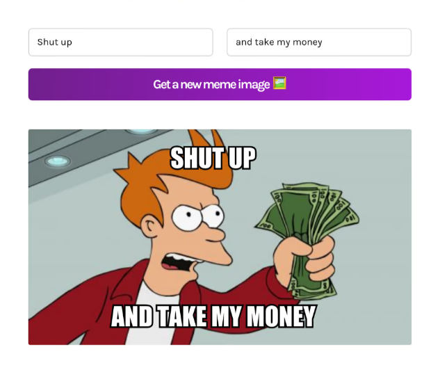

# Meme Generator

This is a Meme Generator built with ReactJS that fetches the top meme images from an API and allows users to create and customize memes with real-time image and text integration.



## Features

- **Fetch Meme Images:** Retrieves popular meme images from a public API.
- **Text Overlay:** Allows users to add custom text to meme images.
- **Real-Time Preview:** Instant updates to the meme as the user types.
- **Downloadable Memes:** Users can download the memes they create.

**To Clone the repository:**
 ```bash
git clone https://github.com/whysatyam/Meme-Generator
